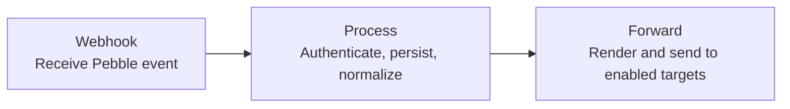

# Pebble Index 01 input adapter

A thin, durable adapter between Pebble's multipart webhook and a configurable HTTP
event receiver.

This service does only four things:

1. Authenticate the public Pebble webhook.
2. Validate and durably save the payload.
3. Convert Pebble fields into a normalized event envelope.
4. Forward the event and optional audio to a configured target.

## Flow



The endpoint is:

```text
POST /webhooks/index01
Authorization: Bearer <WEBHOOK_TOKEN>
```

The adapter immediately returns `202` after durable local acceptance. Its worker sends
the event concurrently to every enabled target in `targets.yaml`. Each target controls
its URL, authentication, headers, multipart field names, JSON template, and optional
status lookup. An audio event defaults to the Japanese language hint `ja`;
`PEBBLE_LANGUAGE_HINT` can override or disable it.

## Template input

Before rendering a target-specific payload, the adapter constructs this canonical event:

```json
{
  "event_id": "pebble_index:<local-id>",
  "source": "pebble_index",
  "sender_id": "<configured sender or Pebble client>",
  "conversation_id": "personal",
  "content": [{"type": "text", "text": "example"}],
  "reply": {"adapter": "pebble_index", "target": "<local-id>"},
  "metadata": {
    "recorded_at": "<Pebble timestamp>",
    "client": "<Pebble client>",
    "trigger": "<optional trigger>",
    "input_transcription": "<optional Pebble transcript>"
  }
}
```

This adapter-specific structure is available to Jinja as `event`. Each target template
can transform it into the structure expected by that receiver.

## Target interface

Each target chooses `multipart` or `json` with `request.body_format`. The default is
`multipart`: one field contains the rendered JSON and, for recordings, another contains
the audio file. The target configures both field names as well as the audio filename and
media type. A `json` target receives the rendered template as its complete JSON request
body and does not receive the audio attachment. This is useful for notifications and
other text or metadata-only APIs.

Any successful JSON, text, or empty HTTP response counts as a completed delivery. A
target that configures status lookup must return a JSON object containing the configured
ID field. No particular event schema is imposed because each target's template defines
its request body.

## Configure

```bash
cp .env.example .env
cp targets.example.yaml targets.yaml
set -a; source .env; set +a
uv sync
uv run uvicorn app.main:app --host 0.0.0.0 --port 8787
```

Generate a public webhook credential and any credentials required by your targets:

```bash
openssl rand -hex 32  # WEBHOOK_TOKEN: configured in Pebble
openssl rand -hex 32  # for a target's token_env variable, when required
```

Keep secrets in `.env` and reference their variable names with `auth.token_env` or
`url_env`; avoid placing tokens or credential-bearing URLs directly in YAML. Do not
reuse the public Pebble token for a target.

## Target configuration

`targets.example.yaml` contains a complete example. Every enabled entry receives the
event. The adapter automatically loads `./targets.yaml`; `TARGETS_CONFIG_PATH` can point
to a different location. A minimal target looks like this:

```yaml
version: 1
targets:
  - name: receiver
    url: https://receiver.example.com/events
    auth:
      header: Authorization
      scheme: Bearer
      token_env: RECEIVER_TOKEN
    request:
      body_format: multipart
      event_field: event
      audio_field: audio
      template: |
        {{ event | tojson }}
```

Templates use sandboxed Jinja with strict undefined values and must render valid JSON.
They can select, rename, nest, or omit fields. The `tojson` filter should be used when
inserting values so strings and nulls remain valid JSON.

Static `headers` may be added to a target. `request` can also set `body_format`,
`audio_filename`, `audio_mime_type`, and `include_audio`. JSON requests default to
`include_audio: false` and reject `include_audio: true`. A target URL that contains a
credential can be read from an environment variable with `url_env` instead of being
stored in YAML. Status lookup is optional:

```yaml
status:
  url_template: https://receiver.example.com/events/{id}
  id_field: id
```

`id_field` names the field in the target's POST response. Its value replaces `{id}` in
the status URL. Targets without `status` are fire-and-forget after acceptance.

Delivery results are saved independently under `metadata.deliveries`. The overall event
status is `forwarded` when all targets succeed, `partial` when some succeed, and `failed`
when none succeed.

## Examples

### Audio-capable receiver

Suppose an HTTP service accepts a JSON event envelope and an optional audio recording
in the same `multipart/form-data` request. The adapter can send Pebble recordings to
that service with a target such as:

```yaml
- name: audio-event-receiver
  url: https://receiver.example.com/events
  auth:
    header: Authorization
    scheme: Bearer
    token_env: RECEIVER_TOKEN
  request:
    body_format: multipart
    event_field: event
    audio_field: audio
    audio_filename: index-recording.m4a
    audio_mime_type: audio/mp4
    include_audio: true
    template: |
      {
        "event_id": {{ event.event_id | tojson }},
        "source": {{ event.source | tojson }},
        "sender_id": {{ event.sender_id | tojson }},
        "conversation_id": {{ event.conversation_id | tojson }},
        "content": {{ event.content | tojson }},
        "reply": {{ event.reply | tojson }},
        "metadata": {{ event.metadata | tojson }}
      }
  status:
    url_template: https://receiver.example.com/events/{id}
    id_field: id
```

For a recording, the receiver gets one multipart field named `event` containing the
rendered JSON and one named `audio` containing the M4A file. The JSON `content` array
identifies the recording as an audio input and references that multipart attachment:

```json
{
  "content": [
    {
      "type": "audio",
      "attachment": "audio",
      "mime_type": "audio/mp4",
      "language": "ja"
    }
  ]
}
```

The receiver may transcribe the recording, store it, or pass it to another system. If
Pebble supplied its own transcription, it remains available as
`metadata.input_transcription`; the adapter does not choose which transcription the
receiver should use. If status lookup is configured, the receiver's POST response must
include the field named by `id_field`. Otherwise, a successful JSON, text, or empty
response is accepted.

### Slack receipt notification

Because targets are independent and receive events concurrently, one target can handle
the recording while another posts a receipt notification. For example, this JSON target
can be added alongside the audio receiver above:

```yaml
- name: slack-receipt
  url_env: SLACK_WEBHOOK_URL
  request:
    body_format: json
    include_audio: false
    template: |
      {
        "text": {{ ("Pebble input received: " ~ event.event_id) | tojson }}
      }
```

Set `SLACK_WEBHOOK_URL` to a Slack Incoming Webhook URL and keep it out of the YAML and
version control because the URL is a secret. Slack receives a normal JSON request; it
does not receive the recording. See Slack's
[Incoming Webhooks documentation](https://docs.slack.dev/messaging/sending-messages-using-incoming-webhooks/)
for setup and message formatting.

When `TARGETS_CONFIG_PATH` is unset, the previous single-target `TARGET_*` environment
variables remain supported when no `./targets.yaml` exists. Existing `GATEWAY_URL`,
`GATEWAY_TOKEN`, and `GATEWAY_TIMEOUT_SECONDS` deployments also remain compatible;
`GATEWAY_URL` is treated as a base URL and expanded to `/v1/events`.

## Inspect an event

```bash
curl http://127.0.0.1:8787/events/EVENT_ID \
  -H "Authorization: Bearer $WEBHOOK_TOKEN"
```

The response always includes local delivery metadata. It also includes current status
and results for targets that configure status lookup.

## Test

```bash
uv run pytest
```

## License

[MIT License](LICENSE)
